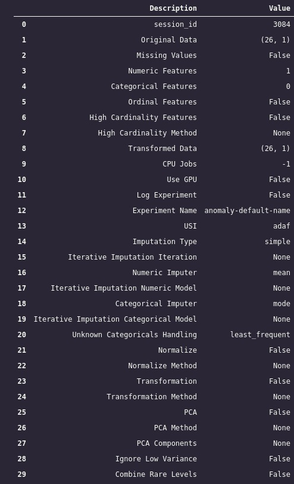
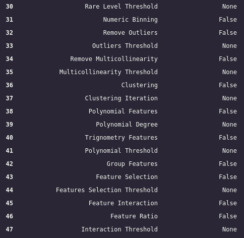
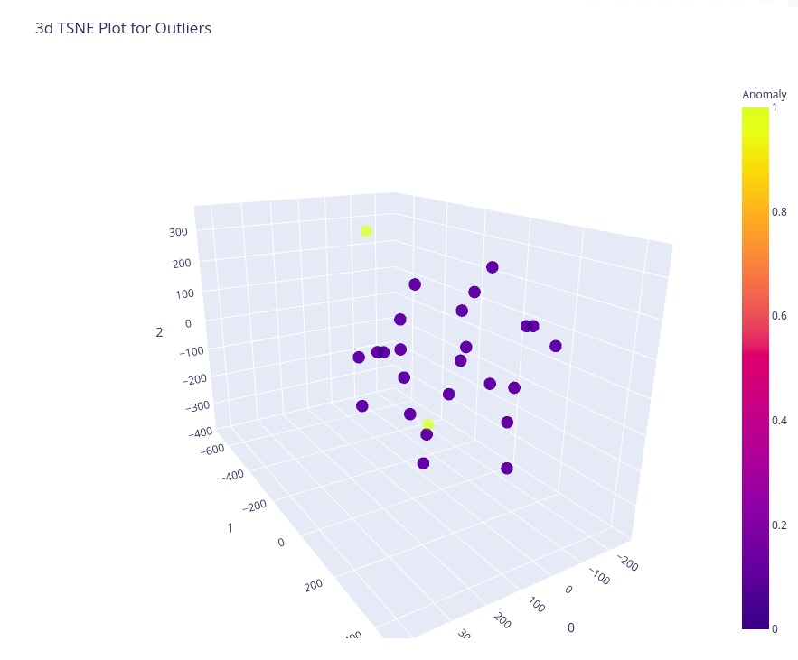

# Anomaly Detection Pycaret

### Este script jupyter mostra como empregar uma detecção de anomalia utilizando o pycaret


```python
from pycaret.utils import version
version()
import pandas as pd
import numpy as np
```

## Criação da Base


```python
#Created dataset
dataset  = [23,45,27,76,56,89,23,210,78,43,76,89,2,54,87,12,90,98,345,76,45,14,76,16,17,9]

#Converting to dataframe and assigning col name as Values
df = pd.DataFrame(dataset, columns = ["Values"])


```

### Importando biblioteca e inicializando o metodo setup()


```python
#import anomaly detection module
from pycaret.anomaly import *

#intialize the setup
outliers = setup(df , numeric_features = ["Values"])
```



### Criando o modelo Isolation Forest


```python
#Creating a model
iso_forest = create_model('iforest')
print(iso_forest)

```

    IForest(behaviour='new', bootstrap=False, contamination=0.05,
        max_features=1.0, max_samples='auto', n_estimators=100, n_jobs=-1,
        random_state=3084, verbose=0)


### Plotando o modelo


```python
#plotting the model
plot_model(iso_forest)

```


### Visualizando os rótulos


```python
#Assigning the labels
outlier_results = assign_model(iso_forest)
print(outlier_results)

```

        Values  Anomaly  Anomaly_Score
    0       23        0      -0.255071
    1       45        0      -0.256781
    2       27        0      -0.223371
    3       76        0      -0.291227
    4       56        0      -0.244322
    5       89        0      -0.273344
    6       23        0      -0.255071
    7      210        1       0.033511
    8       78        0      -0.260146
    9       43        0      -0.231153
    10      76        0      -0.291227
    11      89        0      -0.273344
    12       2        0      -0.100532
    13      54        0      -0.243600
    14      87        0      -0.254562
    15      12        0      -0.247237
    16      90        0      -0.254604
    17      98        0      -0.136883
    18     345        1       0.124027
    19      76        0      -0.291227
    20      45        0      -0.256781
    21      14        0      -0.254928
    22      76        0      -0.291227
    23      16        0      -0.260118
    24      17        0      -0.259104
    25       9        0      -0.216914


```python

```
